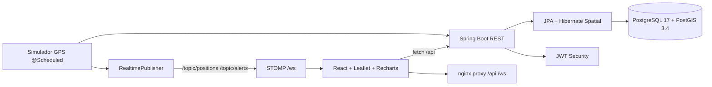

# GeoLogix Dashboard

Plataforma de trazabilidad y monitoreo de flota en tiempo real, de mi autoría como proyecto de portafolio. Simula una flota de camiones de reparto sobre Guayaquil, la visualiza en un mapa en vivo, genera alertas por reglas de negocio y análisis geoespacial, y expone todo vía API REST + WebSockets.

> Demo en vivo: `http://3.15.179.146/` — usuario demo: `operador / geologix123` (solo monitoreo).
> Nota: la IP es efímera (sin dominio ni Elastic IP); si no responde, levanta el proyecto local con Docker (abajo).


*Mapa en vivo + panel de flota + alertas. Para regenerar el GIF: graba 15–20 s de la demo y guárdalo como `docs/demo.gif`.*

---

## Qué demuestra

- Backend con dominio real (vehículos, posiciones, alertas, zonas) y persistencia geoespacial.
- Tiempo real con WebSockets/STOMP (posiciones y alertas sin recargar).
- GIS aplicado: geofences poligonales, detección de entrada/salida con PostGIS, distancia recorrida sobre geometrías.
- Auth con JWT y roles (ADMIN / OPERADOR), frontend con mapa, KPIs y dos idiomas (ES/EN).
- Despliegue reproducible con Docker y operación en instancia pequeña (límites y mantenimiento documentados).

## Funcionalidades

- Mapa Leaflet en vivo: 4 camiones con posición, velocidad y estado; click en un camión dibuja su ruta.
- KPIs con Recharts: velocidad de la flota en vivo + tarjetas (vehículos, activos, velocidad promedio, alertas).
- Alertas en tiempo real: exceso de velocidad, detención prolongada, entrada/salida de zona. Tabs Activas/Historial, resolver individual o todas, contador real.
- Zonas (geofences): 5 zonas precargadas en Guayaquil; dibujo en el mapa, activar/desactivar, borrar (solo ADMIN).
- Cuentas demo con roles: OPERADOR solo monitorea; ADMIN gestiona zonas y usuarios.

## Arquitectura



## Stack

| Capa | Tecnología |
|---|---|
| Backend | Java 21 · Spring Boot 4.0.8 · Data JPA · WebSocket/STOMP · Security + JJWT 0.12.6 · Hibernate Spatial · Lombok |
| Frontend | React 19 · Vite 8 · Leaflet 1.9 + react-leaflet 5 · Recharts 3 · i18next ES/EN · Tailwind CSS 4.3.3 · STOMP.js + SockJS |
| Datos | PostgreSQL 17 + PostGIS 3.4 (geometrías `Point/Polygon 4326`, `ST_Within`, `ST_MakeLine`, `ST_Length`) |
| Infra | Docker / docker-compose · nginx (proxy `/api` y `/ws`) · EC2 t3.micro |

## Estructura

```
geologix-dashboard/
├── backend/                 # API Spring Boot (com.geologix)
├── frontend/                # Dashboard React (Vite)
├── infra/
│   ├── initdb/              # extensión PostGIS
│   └── aws/                 # user-data.sh + guía EC2
├── docker-compose.yml       # PostGIS local (puerto host 5433)
├── docker-compose.prod.yml  # postgis + backend + frontend
├── .env.example
└── README.md
```

## API principal

| Método | Ruta | Auth | Descripción |
|---|---|---|---|
| POST | `/api/auth/login` | pública | Devuelve JWT |
| GET | `/api/auth/me` | JWT | Perfil propio |
| POST | `/api/auth/register` | ADMIN | Crea usuario (`username`, `password`, `role`) |
| GET | `/api/vehicles` | JWT | Flota con última posición |
| GET | `/api/vehicles/{id}` | JWT | Un vehículo |
| GET | `/api/vehicles/{id}/positions` | JWT | Historial (recientes primero) |
| GET | `/api/vehicles/{id}/distance` | JWT | Km recorridos (PostGIS) |
| GET | `/api/alerts?activa=true` | JWT | Activas |
| GET | `/api/alerts?limit=100` | JWT | Historial |
| GET | `/api/alerts/count?activa=true` | JWT | Contador real |
| PATCH | `/api/alerts/{id}/resolver` | JWT | Resuelve una |
| PATCH | `/api/alerts/resolver-todas` | JWT | Resuelve todas |
| GET | `/api/geofences` | JWT | Zonas con polígonos |
| POST | `/api/geofences` | ADMIN | Crea zona |
| PUT | `/api/geofences/{id}` | ADMIN | Actualiza zona |
| PATCH | `/api/geofences/{id}/activa` | ADMIN | Activa/desactiva |
| DELETE | `/api/geofences/{id}` | ADMIN | Borra (cierra sus alertas) |

WebSockets: endpoint `/ws`, tópicos `/topic/positions` y `/topic/alerts`.

## Cómo correrlo

### Opción A — todo con Docker (recomendada)

```bash
cp .env.example .env   # completa JWT secret y puertos
docker compose -f docker-compose.yml -f docker-compose.prod.yml up --build
```

Abre `http://localhost/` y entra con `operador / geologix123`.

### Opción B — desarrollo local

```bash
# 1. PostGIS (puerto host 5433; no tocar un Postgres local en 5432)
docker compose up -d postgis

# 2. Backend (puerto 8080)
cd backend
./mvnw spring-boot:run

# 3. Frontend (puerto 5173, proxy /api y /ws al backend)
cd frontend
npm install
npm run dev
```

## Credenciales

| Usuario | Clave | Rol | Uso |
|---|---|---|---|
| `operador` | `geologix123` | OPERADOR | Demo pública (monitoreo) |
| `demo` | `Demo2026*Geo` | OPERADOR | Demo alternativa |

Las cuentas ADMIN son privadas y no se publican. La cuenta `admin` inicial del seed está desactivada en despliegues públicos.

## Decisiones de diseño

- **WebSockets en vez de polling**: el monitoreo exige latencia baja y empuje del servidor.
- **PostGIS desde el inicio**: posiciones como `geometry(Point,4326)` y zonas como `Polygon`; entrada/salida con `ST_Within`, distancia con `ST_MakeLine` + `ST_Length`.
- **JWT stateless con roles**: `/api/auth/**` y `/ws/**` públicos para login y handshake; el resto exige token.
- **Nginx como único borde**: el frontend sirve el estático y proxifica `/api` y `/ws` al backend (sin exponer el 8080 a internet).
- **i18n base español**: `es.json` como base y fallback, `en.json` completo, switch en la UI.

## Operación (aprendido en EC2 t3.micro)

- Instancia pequeña (1 GB RAM): **no correr `up --build` ahí** (los builds de backend/frontend agotan CPU/RAM). Construir imágenes fuera o recrear contenedores sin rebuild.
- La tabla `positions` crece ~170k filas/día (tick 2 s × 4 vehículos). Sin purga, las consultas sin límite agotan el heap (`OutOfMemoryError`). Purga sugerida (cron diario 03:00):
  `DELETE FROM positions` conservando las últimas 2000 por vehículo + `DELETE FROM alerts` de más de 7 días.
- Seguridad: SG con `80` público, `8080` cerrado, `22` restringido (tu IP para SSH, rango `ec2-instance-connect` de la región para el botón del navegador).
- Costos: Billing Budget mensual de $5 con alerta por email desde el día 1.

## Roadmap

- Paginar `GET /vehicles/{id}/positions?limit=` y consulta `Top1` para la última posición (evita cargar historiales completos).
- Tests (JUnit + Vitest) y CI con GitHub Actions.
- Dominio + HTTPS y Elastic IP para demo estable.
- Colas (SQS vía LocalStack en dev) para arquitectura orientada a eventos.

## Licencia

Proyecto de portafolio personal de mi autoría. Uso educativo/demostrativo.
